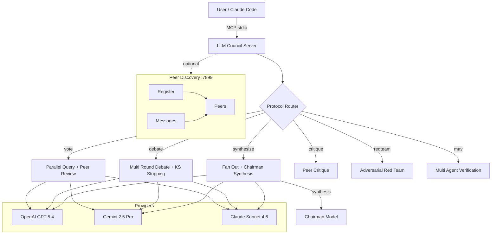

# LLM Council

Multi LLM deliberation council: query frontier models in parallel, then combine their responses through structured protocols (voting, debate, synthesis, critique, red teaming, verification). Ships as an MCP server and Claude Code skill.

## Architecture



## Features

* **Vote.** Each model answers independently, then all models anonymously rank each other. Winner selected by first place votes with confidence score.
* **Debate.** Multi round argumentation with optional KS statistic adaptive stopping. Chairman synthesizes the final round into a consensus answer.
* **Synthesize.** Fan out to all models, then a chairman model produces an authoritative synthesis combining the best elements.
* **Critique.** Models answer, then peer review each other's responses with structured feedback.
* **Red Team.** Adversarial variant of critique that actively probes for flaws, hallucinations, and failure modes.
* **MAV (Model as Verifier).** Cross checks a candidate answer using multiple models. Each model scores the candidate, highest scored response becomes verified output.

## MCP Tools

| Tool | Description |
|------|-------------|
| `council_deliberate` | Full council deliberation with configurable protocol, models, and chairman |
| `council_vote` | Quick voting: all models answer, then anonymously rank each other |
| `council_debate` | Structured multi round debate with optional KS statistic early stopping |
| `council_critique` | Peer critique or adversarial red teaming of model responses |
| `council_verify` | MAV cross check: multiple models independently verify a candidate answer |
| `council_estimate_cost` | Estimate USD cost of a council run before executing it |
| `council_status` | Check which providers have API keys configured and list available models |
| `council_configure` | Update default council composition, chairman, or protocol for the session |

## Quick Start

```bash
npm install && npm run build
claude mcp add llmcouncil node ~/llmcouncil/dist/server.js
```

Set the required environment variables:

```bash
export OPENAI_API_KEY="..."
export GEMINI_API_KEY="..."
export ANTHROPIC_API_KEY="..."
```

Then use `/council` in Claude Code or call any `council_*` tool directly.

## Protocols

### Vote

Models answer in parallel, then each model ranks all responses anonymously (labels like ModelA, ModelB, ModelC). The winner is selected by first place vote count. Anonymous peer review prevents favoritism bias that occurs when models see provider names.

### Debate

Inspired by S2 MAD (Society of Mind with Adaptive Debate). Models argue across rounds, with each round seeing all prior responses. An optional KS statistic test measures response convergence between rounds. When the distribution shift drops below epsilon for consecutive rounds, debate stops early. **Adaptive stopping cuts costs up to 94.5%** compared to fixed round debate.

### Synthesize

The chairman pattern. All models respond in parallel, then a designated chairman model (default: Claude Sonnet 4.6) produces an authoritative synthesis. Effective for questions where combining perspectives yields a better answer than any single model.

### Critique

Each model answers, then critiques every other model's response. Produces structured feedback identifying strengths, weaknesses, and gaps. Useful for quality assurance on important outputs.

### Red Team

Adversarial variant of critique. Models actively try to find flaws, hallucinations, logical errors, and edge cases in each other's responses. Use this to stress test API designs, arguments, or any output where failure modes matter.

### MAV (Model as Verifier)

From the Model as Verifier literature. Multiple models independently score a candidate answer. The highest scored response becomes the verified output. Designed for fact checking and validation where **consensus is not verification** (March 2026 paper). Dissent scores surface which models disagree and by how much.

### Research Basis

Key patterns from multi LLM deliberation research:

* **Scale agents, not rounds.** Adding more models improves quality more than adding debate turns.
* **Anonymous peer review prevents favoritism.** Models exhibit provider bias when identities are visible.
* **S2 MAD adaptive stopping cuts costs up to 94.5%.** KS statistic convergence detection eliminates wasted rounds.
* **Heterogeneous models outperform homogeneous.** Mixing providers (OpenAI + Google + Anthropic) produces stronger consensus than three instances of the same model.
* **Consensus is not verification (March 2026 paper).** Multiple models agreeing does not guarantee correctness. MAV scoring provides a stronger signal than majority vote alone.

## Cost Estimation

Example output from `council_estimate_cost` for a 3 model vote with default pricing:

```json
{
  "protocol": "vote",
  "models": [
    { "model": "gpt-5.4", "provider": "openai", "costPerRound": 0.007, "totalCost": 0.007 },
    { "model": "gemini-2.5-pro", "provider": "gemini", "costPerRound": 0.006250, "totalCost": 0.006250 },
    { "model": "claude-sonnet-4-6-20250514", "provider": "anthropic", "costPerRound": 0.0105, "totalCost": 0.0105 }
  ],
  "rounds": 1,
  "avgInputTokens": 1000,
  "avgOutputTokens": 500,
  "estimatedCostUsd": 0.0475,
  "note": "Estimate only. Actual cost depends on prompt length and response verbosity."
}
```

The vote protocol applies a 2x multiplier (initial answers + peer ranking round). Debate multiplies by the number of rounds. Always run `council_estimate_cost` before large runs.

## Models Supported

| Provider | Model | Input $/1M | Output $/1M |
|----------|-------|-----------|------------|
| OpenAI | gpt 5.4 | $2.00 | $10.00 |
| OpenAI | gpt 5 | $1.25 | $10.00 |
| OpenAI | gpt 5 mini | $0.25 | $1.00 |
| OpenAI | o3 | $2.00 | $8.00 |
| OpenAI | o4 mini | $1.10 | $4.40 |
| OpenAI | gpt 4.1 | $2.00 | $8.00 |
| Google | Gemini 2.5 Pro | $1.25 | $10.00 |
| Google | Gemini 2.5 Flash | $0.15 | $0.60 |
| Anthropic | Claude Sonnet 4.6 | $3.00 | $15.00 |
| Anthropic | Claude Opus 4.6 | $15.00 | $75.00 |
| Anthropic | Claude Haiku 4.5 | $0.80 | $4.00 |

Default council: GPT 5.4 + Gemini 2.5 Pro + Claude Sonnet 4.6. Override via `council_configure` or pass `models` to any tool.

## Peer Discovery Broker

Optional HTTP broker on port 7899 enables peer discovery between multiple council instances. Useful for distributed setups where separate Claude Code sessions need to coordinate.

```bash
npm run broker
```

Endpoints: `/register`, `/unregister`, `/peers`, `/sendMessage`, `/pollMessages`, `/health`.

## License

MIT
